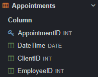

# ФИО и группа
**Пшеничников Станислав Юрьевич** \
**ИС 22/9-1** 

## 2 Описание БД


**Эта база данных представляет собой систему управления барбершопом, обеспечивая эффективное ведение клиентской базы, записи на услуги и учет финансовых операций. В нее входят такие таблицы как:** 
- Appointments
- Clients
- Employees
- Payments
- Reviews
- Services.


## 2.1 Appointments 
 
 
 

> AppointmentID - INT - Айди назначения\
DateTime - DATE - Время\
ClientID - INT - Айди клиента\
EmployeeID - INT - Айди работника

## 2.2 Clients 


> ClientID - INT - Айди клиента\
FirstName - VARCHAR(255) - Имя\
LastName - VARCHAR(255) - Фамилия\
PhoneNumber - VARCHAR(255) - Номер телефона\
Email - VARCHAR(255) - Почта\
Gender - VARCHAR(255) - Гендер

## 2.3 Employees 


> EmployeeID - INT - Айди работника\
FirstName - VARCHAR(255) - Имя\
LastName - VARCHAR(255) - Фамилия\
PhoneNumber - VARCHAR(255) - Номер телефона\
Email - VARCHAR(255) - Почта\
Specialization - VARCHAR(255) - Специализация работника\
Gender - VARCHAR(255) - Гендер

## 2.4 Payments 


> PaymentID - INT - Айди платежа\
AppointmentID - INT - Айди назначения\
PaymentAmount - DECIMAL(10,2) - К оплате\
PaymentDateTime - DATE - Дата оплаты

## 2.5 Reviews 


> ReviewID - INT - Айди отзыва\
ClientID - INT - Айди клиента\
ReviewText - TEXT - Текст отзыва\
Rating - INT - Рейтинг

## 2.6 Services  


> ServiceID - INT - Айди услуги\
Description - TEXT - Описание\
Price - DECIMAL(10,2) - Цена\
EmployeeID - INT - Айди работника

## 3 UNION 


```sql
SELECT firstname, lastname FROM Clients
UNION
SELECT firstname, lastname FROM Employees
```
**Этот запрос вернет список имен и фамилий клиентов и работников**

## 4 ORDER BY  


```sql
SELECT ClientS.FirstName
from Clients
order by gender
```
**Этот запрос выводит сортировку по гендеру работников. (Сначала идут мужчины, после - женщины)**

## 5 HAVING 


```sql
SELECT e.employeeid, e.firstname, e.lastname, COUNT(s.serviceid) AS services_count
FROM employees e
JOIN services s ON e.employeeid = s.employeeid
GROUP BY e.employeeid, e.firstname, e.lastname
HAVING COUNT(s.serviceid) > 0;
```

**Этот запрос сначала группирует записи по работникам и считает количество услуг этих сотрудников. После этого фильтрует тех сотрудников, которые предоставили больше 0 услуг**

## 6 ВЛОЖЕННЫЕ ЗАПРОСЫ

### 6.1 В SELECT


```sql
SELECT e.firstname, e.lastname,
    (SELECT MAX(price) FROM services WHERE employeeid = e.employeeid) AS max_price
FROM employees e;
```

**Этот запрос использует SELECT для получения максимальной цены услуги сотрудника. Это позволяет подставлять максимальную цену услуги для каждого работника в результате выборки**


### 6.2 В WHERE


```sql
SELECT e.firstname, e.lastname
FROM employees e
WHERE e.employeeid IN (
    SELECT employeeid FROM services WHERE price > 1500
);
```
**Этот запрос использует SELECT в WHERE для фильтра работников, которые предоставили хотя бы 1 услугу дороже 1500. Происходит это благодаря выборке айди сотрудников из таблицы услуг, где цена выше 1500**

## 7 ОКОННЫЕ ФУНКЦИИ

### 7.1 АГРЕГАТНЫЕ ФУНКЦИИ


```sql

SELECT Min(price) AS МинимальнаяЦена, Max(price) AS МаксимальнаяЦена, AVG(price) AS СредняяЦена
FROM Services

```
**Вывод минимальной, максимальной, средней цены за услугу стрижки**

### 7.2 РАНЖИРУЮЩИЕ ФУНКЦИИ


```sql
SELECT paymentid, paymentamount, RANK() OVER (ORDER BY paymentamount DESC) AS payment_rank
FROM payments;
```

**Запрос использует ранжирующую функцию для присвоения ранга каждому платежу на основе суммы платежа. Ранги упорядочены по убыванию сумм платежей. Результат покажет ранг каждого платежа вместе с суммой платежа**


### 7.3 ФУНКЦИИ СМЕЩЕНИЯ


```sql
SELECT paymentid, paymentamount, LEAD(paymentamount) OVER (ORDER BY paymentdatetime) AS next_paymentamount
FROM payments;
```
**Используется для получения значения из следующей строки в порядке сортировки. Этот запрос выводит айди платежа, сумму платежа и сумму следующего платежа**

## 8 JOIN

### 8.1 INNER JOIN

 

```sql

SELECT Clients.Firstname, Reviews.ReviewsText
FROM Clients
JOIN Reviews USING (clientid)

```
**Этот запрос выводит имена клиентов и отзыв, который они написали**

### 8.2 LEFT JOIN


```sql

SELECT Appointments.EmployeeID
FROM Appointments
LEFT JOIN Employees USING (employeeid)

```
**Этот запрос выводит айди работников**

### 8.3 RIGHT JOIN 


```sql

SELECT Reviews.ClientID, gender
FROM Reviews
RIGHT JOIN Clients USING (clientid)

```
**Этот запрос выводит айди клиентов и их гендер**

### 8.4 FULL OUTER JOIN


```sql

SELECT Services.Price, employeeid
FROM Services
FULL OUTER JOIN Employees USING (employeeid)

```

**Этот запрос выводит айди работника и его цену за услугу стрижки**

### 8.5 CROSS JOIN


**Этот запрос выводит совпадение из таблиц клиенты и работники, то есть совпадающее имя клиента и работника - Василий**

## 9 CASE


**Этот запрос выполняет следующие действия:\
Если имя клиента начинается на 'В', то вывод 1. Если имя клиента начинается на А, то вывод 2, иначе выводит 0**

## 10 WITH


```sql
WITH HighPayments AS (
    SELECT paymentid, appointmentid, paymentamount
    FROM payments
    WHERE paymentamount > 1200
)
SELECT a.datetime, a.clientid, p.paymentamount
FROM appointments a
JOIN HighPayments p ON a.appointmentid = p.appointmentid;
```

**Этот запрос создает временную таблицу, которая содержит информацию о платежах больше 1200. После этого соединяет эту таблицу с таблицей записей Appointments, чтобы отобразить дату, время приема, айди клиента и сумму платежа**


