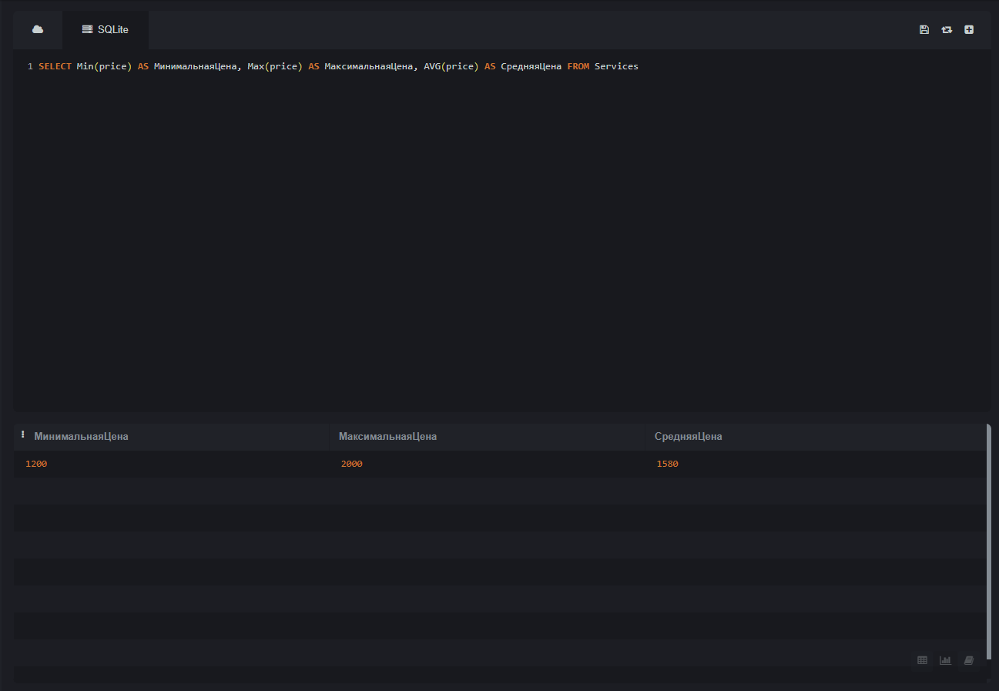
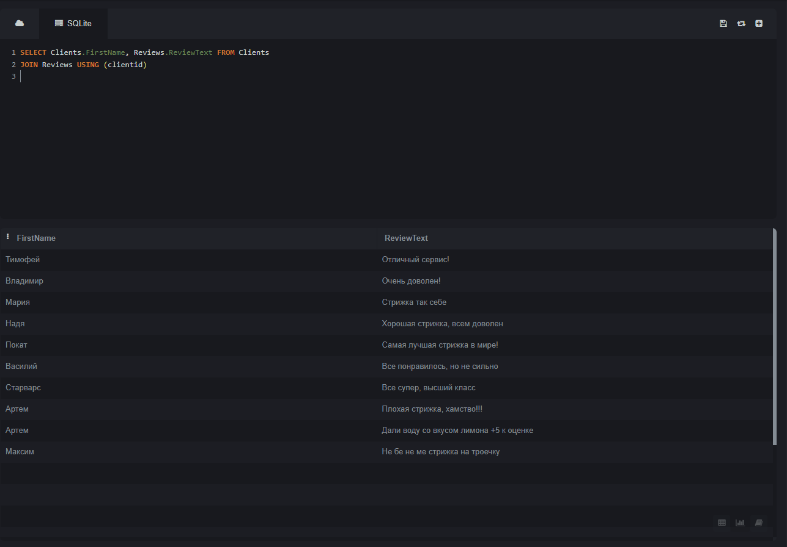
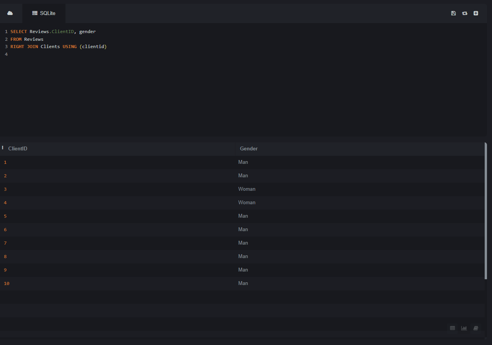
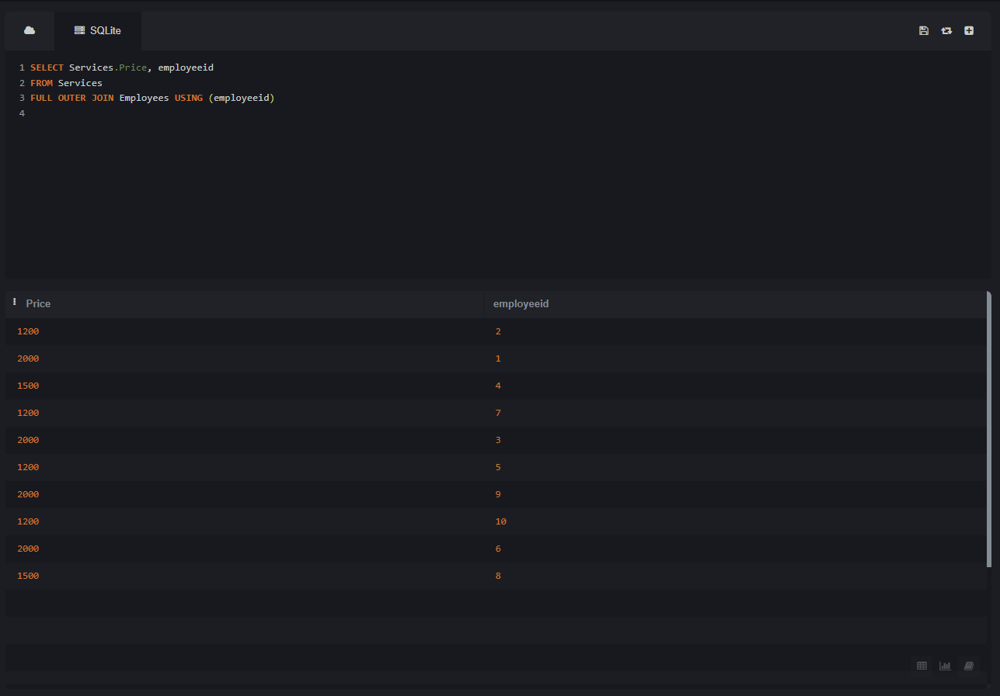

# ФИО и группа
**Пшеничников Станислав Юрьевич** \
**ИС 22/9-1** 

## 2
База данных барбершопа.

## 2.1 Appointments 
 
AppointmentID - INT - Айди назначения\
DateTime - DATE - Время\
ClientID - INT - Айди клиента\
EmployeeID - INT - Айди работника

## 2.2 Clients 

ClientID - INT - Айди клиента\
FirstName - VARCHAR(255) - Имя\
LastName - VARCHAR(255) - Фамилия\
PhoneNumber - VARCHAR(255) - Номер телефона\
Email - VARCHAR(255) - Почта\
Gender - VARCHAR(255) - Гендер

## 2.3 Employees 

EmployeeID - INT - Айди работника\
FirstName - VARCHAR(255) - Имя\
LastName - VARCHAR(255) - Фамилия\
PhoneNumber - VARCHAR(255) - Номер телефона\
Email - VARCHAR(255) - Почта\
Specialization - VARCHAR(255) - Специализация работника\
Gender - VARCHAR(255) - Гендер

## 2.4 Payments 

PaymentID - INT - Айди платежа\
AppointmentID - INT - Айди назначения\
PaymentAmount - DECIMAL(10,2) - К оплате\
PaymentDateTime - DATE - Дата оплаты

## 2.5 Reviews 

ReviewID - INT - Айди отзыва\
ClientID - INT - Айди клиента\
ReviewText - TEXT - Текст отзыва\
Rating - INT - Рейтинг

## 2.6 Services  

ServiceID - INT - Айди услуги\
Description - TEXT - Описание\
Price - DECIMAL(10,2) - Цена\
EmployeeID - INT - Айди работника

## 3 UNION 

Как говорил Станислав Юрьевич -
> В процессе...

## 4 ORDER BY  

Как говорил Станислав Юрьевич -
> В процессе...

## 5 HAVING 

Как говорил Станислав Юрьевич -
> В процессе...

## 6 ВЛОЖЕННЫЕ ЗАПРОСЫ

## 7 ОКОННЫЕ ФУНКЦИИ

### 7.1 Агрегатные функции



```sql

SELECT Min(price) AS МинимальнаяЦена, Max(price) AS МаксимальнаяЦена, AVG(price) AS СредняяЦена
FROM Services

```
**Вывод минимальной, максимальной, средней цены за услугу стрижки**

### 7.2 

### 7.3

## 8 JOIN

### 8.1 INNER JOIN

 

```sql

SELECT Clients.Firstname, Reviews.ReviewsText
FROM Clients
JOIN Reviews USING (clientid)

```
**Вывод имени клиента и его отзыва**

### 8.2 LEFT JOIN


```sql

SELECT Appointments.EmployeeID
FROM Appointments
LEFT JOIN Employees USING (employeeid)

```
**Вывод Айди работника**

### 8.3 RIGHT JOIN 



```sql

SELECT Reviews.ClientID, gender
FROM Reviews
RIGHT JOIN Clients USING (clientid)

```
**Вывод Айди клиентов и их гендер**

### 8.4 FULL OUTER JOIN



```sql

SELECT Services.Price, employeeid
FROM Services
FULL OUTER JOIN Employees USING (employeeid)

```

**Вывод Айди работника и их цена за стрижку**

### 8.5 CROSS JOIN


## 9 CASE

## 10 WITH


## 10 WITH


